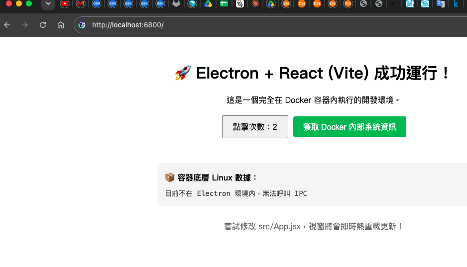
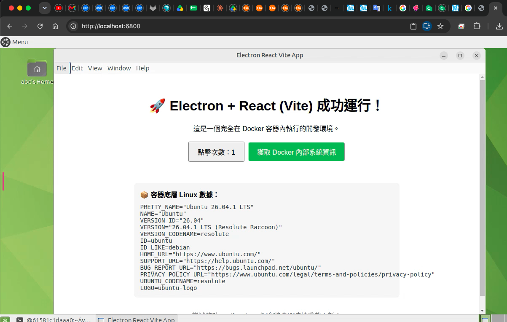
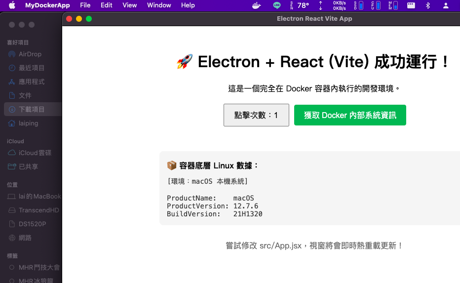
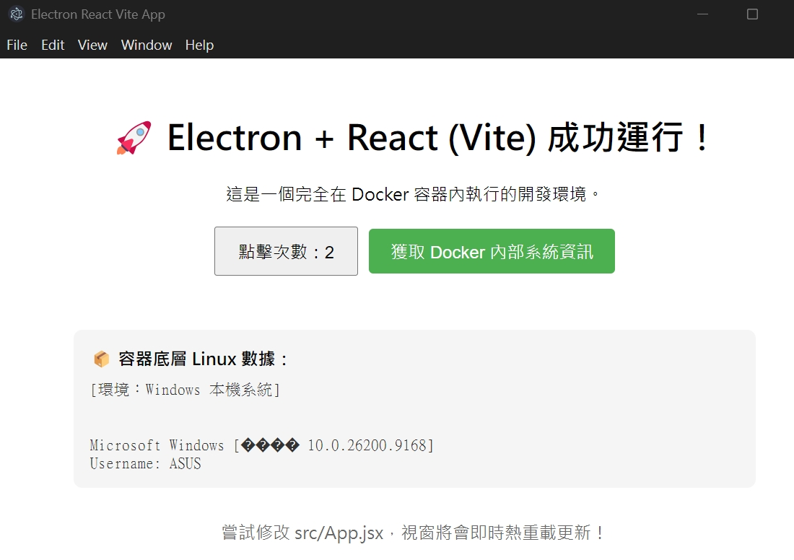

01.Electron+ReactViteOnDocker.md
# Electron + React (Vite) Docker 全容器化開發環境建置指南 (下)

## 四、 專案核心原始碼配置 (Vite + React + Electron)

在跨越通訊埠衝突後，我們將 React (Vite) 開發埠固定在 5173。為了讓應用程式在本地開發與雲端打包間自動切換，我們配置了相關檔案與路徑判斷：

### • package.json：設定了 --no-sandbox 啟動參數以適應 Linux Docker 容器環境，並透過 concurrently 與 wait-on 實現一鍵自動化啟動 Vite 與 Electron。

### • vite.config.js：加入 base: './' 確保打包後採用相對路徑，避免正式版開出白畫面。

### • index.html：放置於專案根目錄下配合 Vite 規範。

### • electron-main.js：主進程實作了 ipcMain.handle 監聽器，透過 child_process 讀取容器內系統數據。

### • src/main.jsx 與 src/App.jsx：作為 React 進入點，並透過 ipcRenderer.invoke 與主進程進行非同步通訊。

(完整的專案設定檔案、原始碼與 JSON/JS/JSX 內容，請參閱原文件中的詳細程式碼區塊。)

---

## 五、 雲端自動化部署 (GitHub Actions CI/CD 排坑全紀錄)

使用 GitHub Actions 免費 macOS 虛擬機打包時，我們解決了 Git Push 的 PAT Token workflow 權限範圍問題，以及 electron-builder 遭遇的 403 Forbidden 錯誤（透過明文宣告 permissions: contents: write 解決）。

最終採用的 .github/workflows/build-mac.yml 設定與矩陣打包機制（支援 x64 與 arm64 雙架構），能自動產出測試用 .dmg 安裝檔。(詳細的 GitHub Actions YAML 設定檔請參閱原文件。)

---

## 六、 無憑證版 (Unsigned) DMG 在 Mac 安裝的專用開啟指南

透過 GitHub Actions 免費打包的 .dmg 因無蘋果數位簽章，安裝時會受 macOS Gatekeeper 阻擋。無痛開啟流程如下：

### 1. 將應用程式拖曳到 「應用程式 (Applications)」 資料夾。

### 2. 點擊 「滑鼠右鍵」（或按 Control 鍵點擊）並選擇 「開啟 (Open)」。

### 3. 在安全性警告中點擊 「仍要開啟 (Open)」 即可放行。

## 七、 產出物與安全機制繞過指南

### 微軟 Defender SmartScreen 機制繞過流程

未受付費數位憑證簽章之測試版軟體在 Windows 首次執行會被 SmartScreen 攔截。
* **解法**：點擊 **「其他資訊 (More info)」** ＞ 點擊 **「仍要執行 (Run anyway)」** 即可正常安裝。

## 八、 接下來？

https://share.google/aimode/QUHtM0d56b5RCq5TN

既然這部分已經徹底排清，我們就來做下一個功能的開發吧！請問你接下來想先朝哪個方向前進？
• 為 Vite + React 引入並設定 TailwindCSS 樣式庫 來美化畫面？
• 撰寫 React 和 Electron 之間的原生 IPC 檔案讀寫（FS），讓軟體在 Windows 上真的能建立與讀取筆記？

今天想到，若版本升級的時候，會需要升級本地資料庫(migration)、更新程式碼（包含版本），在 桌上型應用程式（Electron）會是怎麼做？我們可以先著手這部分。
附帶一提，本地資料庫我偏好 SQLite。
若是上架到 Apple 的 AppStore 跟 Android 的 GooglePlay，若可以，希望兩者都可以用的版本升級流程。

既然我們已經打通了這套最穩健的桌面 SQLite 遷移思維，接下來，我們在您的 React + Electron 專案中，您希望先動手寫哪一部分的實作？
• 【前端渲染實作】：編寫 React UI 畫面，透過 IPC 真正把本地 SQLite 的 Knex 版本號、資料路徑抓到畫面上呈現？
• 【打包出正式檔案】：配置 electron-builder，實質產出一個 .exe (Windows) 或 .dmg (Mac) 實體安裝檔，驗證打包後原生 SQLite 模組是否能正常跑 Migration？
請告訴我您的選擇，我們直接進入下一步代碼的實作！
請告訴我，您接下來想先實作哪一個部分以深化練習：
• 撰寫 React 前端 IPC 呼叫與 UI 渲染，實際在畫面上印出本地 SQLite 資料庫的版本資訊與檔案路徑？
• 配置 electron-builder 打包環境，在您的電腦上實際編譯出實體安裝檔，測試原生 SQLite（better-sqlite3）的打包與編譯？